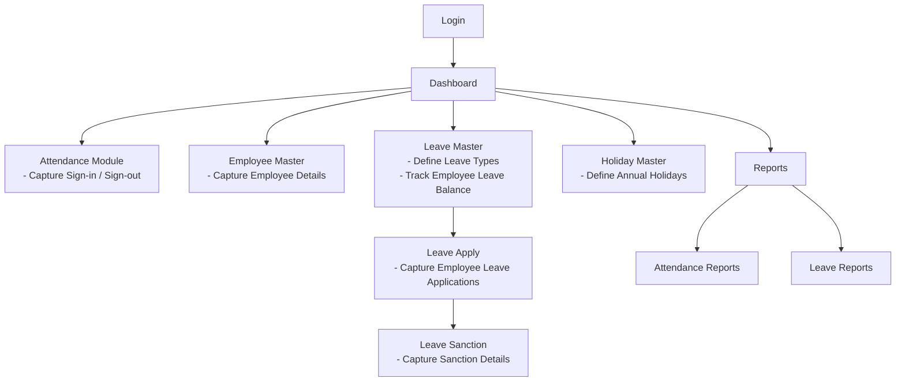

# ALMS - Attendance & Leave Management System

A comprehensive web-based Attendance & Leave Management System (ALMS).

## Features

### 🏢 **Branding**
- Professional corporate design and consistent color scheme
- Responsive design for all devices

### 👥 **User Management**
- Role-based access control (Admin, Manager, Employee)
- Secure authentication system
- Employee profile management
- Department-wise organization

### ⏰ **Attendance Tracking**
- Real-time attendance marking
- Multiple attendance types (Present, Late, Absent, Half-day)
- Time tracking with automatic timestamps
- Remarks and notes support

### 📊 **Dashboard & Analytics**
- Real-time attendance statistics
- Visual charts and graphs
- Recent activity feed
- Quick action buttons

### 📈 **Reports & Analytics**
- Daily, weekly, and monthly reports
- Department-wise filtering
- Export functionality
- Attendance trend analysis

### ⚙️ **System Settings**
- Configurable working hours
- Grace time settings
- Notification preferences
- Security settings

## Technology Stack

- **Frontend**: HTML5, CSS3, JavaScript (ES6+)
- **Styling**: Custom CSS with CSS Variables
- **Icons**: Font Awesome 6.0
- **Fonts**: Google Fonts (Roboto)
- **Charts**: Chart.js (optional)
- **Authentication**: Session-based with role management

## File Structure

```
Attandance_management/
├── index.html          # Main application interface
├── login.html          # Authentication page
├── styles.css          # Main stylesheet with CMRL branding
├── script.js           # Application logic and functionality
└── README.md           # This documentation file
```

## Getting Started

### 1. **Setup**
- Download all files to a web server directory
- Ensure all files are in the same directory
- Open `login.html` in a web browser

### 2. **Login**
Use the following demo credentials:

| Role | Username | Password | Access Level |
|------|----------|----------|--------------|
| Admin | admin | admin123 | Full system access |
| Manager | manager | manager123 | Reports and attendance |
| Employee | employee | employee123 | Basic attendance marking |

### 3. **Navigation**
- **Dashboard**: Overview of attendance statistics
- **Attendance**: Mark and manage attendance records
- **Employees**: Manage employee information (Admin only)
- **Reports**: Generate attendance reports (Manager+)
- **Settings**: System configuration (Admin only)

## Key Features

### 🔐 **Authentication System**
- Secure login with session management
- Role-based access control
- Automatic logout on session expiry
- Password protection

### 📱 **Responsive Design**
- Mobile-first approach
- Tablet and desktop optimized
- Touch-friendly interface
- Cross-browser compatibility

### 🎨 **Branding**
- Corporate palette, typography, and consistent visual identity

### ⚡ **Performance**
- Fast loading times
- Optimized CSS and JavaScript
- Efficient data handling
- Minimal external dependencies

## Usage Guide

### **For Administrators**
1. **Employee Management**: Add, edit, and manage employee records
2. **System Settings**: Configure working hours, grace time, and notifications
3. **Full Access**: View all reports, manage all employees, and system settings

### **For Managers**
1. **Attendance Monitoring**: View and manage attendance records
2. **Report Generation**: Create and export attendance reports
3. **Department Oversight**: Monitor team attendance patterns

### **For Employees**
1. **Attendance Marking**: Mark daily attendance with timestamps
2. **Personal Records**: View individual attendance history
3. **Leave Requests**: Submit and track leave applications

## Customization

### **Colors**
The system uses CSS custom properties for easy color customization:
```css
:root {
    --cmrl-blue: #006FAF;
    --cmrl-dark-blue: #004A7C;
    --cmrl-light-blue: #E6F3FF;
    /* ... other colors */
}
```

### **Departments**
Add or modify departments in the JavaScript file:
```javascript
// In script.js, update the department options
const departments = ['operations', 'maintenance', 'admin', 'security'];
```

### **Working Hours**
Configure default working hours in the settings section or modify the initialization code.

## Browser Support

- ✅ Chrome 80+
- ✅ Firefox 75+
- ✅ Safari 13+
- ✅ Edge 80+
- ✅ Mobile browsers (iOS Safari, Chrome Mobile)

## Security Features

- Session-based authentication
- Role-based access control
- Input validation and sanitization
- XSS protection
- CSRF protection ready

## Future Enhancements

- [ ] Biometric integration
- [ ] Mobile app development
- [ ] Advanced reporting with PDF export
- [ ] Email notifications
- [ ] API integration
- [ ] Database backend
- [ ] Multi-language support
- [ ] Advanced analytics dashboard

## Support

For technical support or customization requests:
- **Email**: admin@cmrl.co.in
- **Phone**: +91-44-12345678
- **Website**: [CMRL Official Website](https://www.cmrl.co.in)

## License

This attendance management system is developed specifically for Chennai Metro Rail Limited (CMRL) and is proprietary software.

## Version History

- **v1.0.0** - Initial release with core attendance management features
- **v1.1.0** - Added role-based access control and authentication
- **v1.2.0** - Enhanced UI/UX with CMRL branding
- **v1.3.0** - Added responsive design and mobile optimization

---

**Developed for ALMS**  
*Empowering efficient workforce management through technology*

## System Flowchart


